# People Playground 한국어 패치 (비공식)

People Playground를 자연스러운 한국어로 플레이할 수 있게 해 주는 비공식 팬 번역 패치입니다.

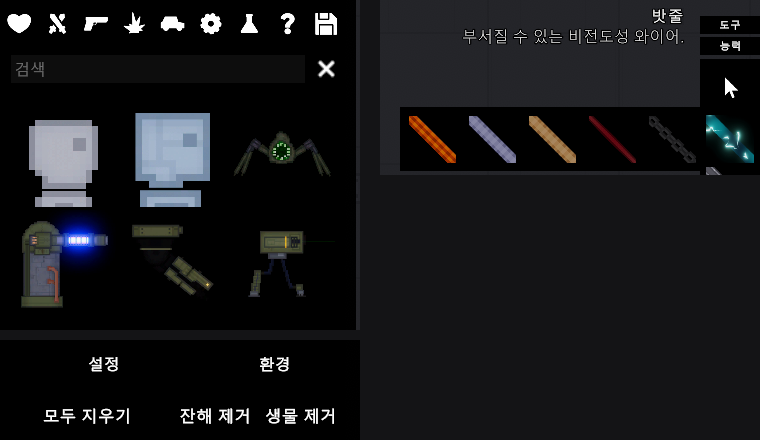

- **번역 범위**: 아이템 285개의 이름과 설명, 메뉴·설정·툴팁, 우클릭 메뉴, 알림, 조작키 설정, 신체 상세 보기, 액체 식별기·원자로 화면 등 약 1,500개 문장
- **기계번역 아님**: 용어집을 정해 문맥에 맞게 직접 번역했고, 아이템 설명의 유머도 살렸습니다
- **한글 폰트**: 윈도우 기본 폰트인 맑은 고딕을 자동으로 불러와 한글을 표시합니다 (폰트 파일을 따로 받을 필요 없음)
- **게임 파일을 고치지 않음**: 원본 게임 파일은 그대로 두고, 실행 중에 화면 글자만 바꿉니다. 지우면 바로 원래대로 돌아갑니다

> 게임 버전 **1.27.18** 기준입니다. Windows 전용입니다.

---

## 전/후 비교

같은 장면을 영어 원본과 한국어 패치로 찍었습니다. (게임 안에서 `ALT+T`로 언제든 바꿔 볼 수 있습니다)

<details open>
<summary><b>메인 메뉴 · 맵 선택 · 설정</b></summary>

**메인 메뉴**
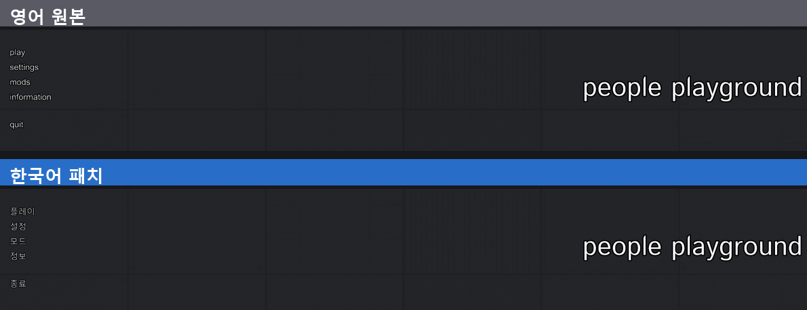

**맵 선택**
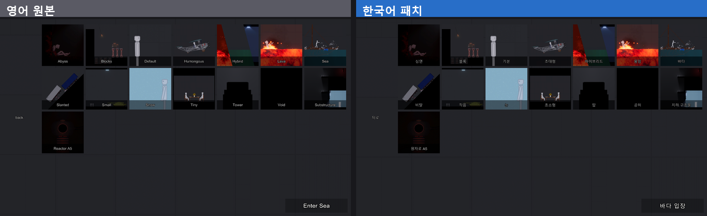

**설정 (일반)**
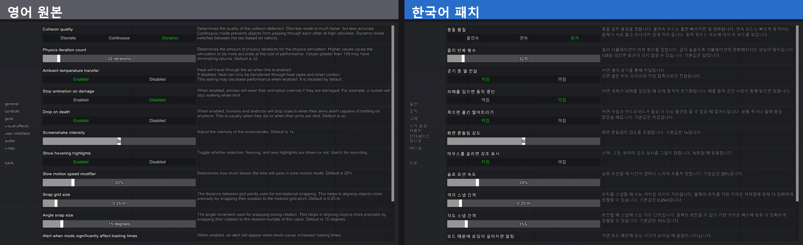

**조작 설정**
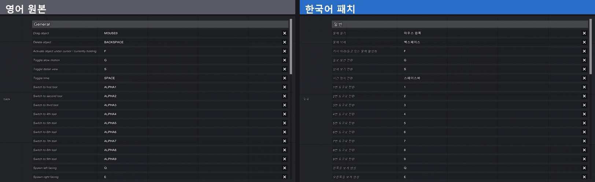

</details>

<details open>
<summary><b>게임 화면</b></summary>

**아이템 설명 툴팁**
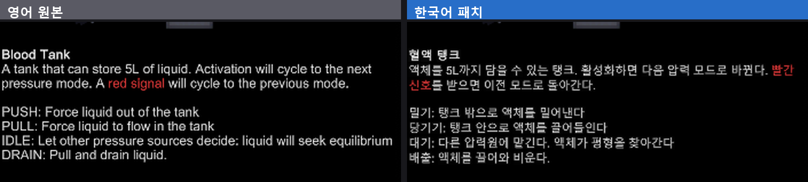

**도구 툴팁**
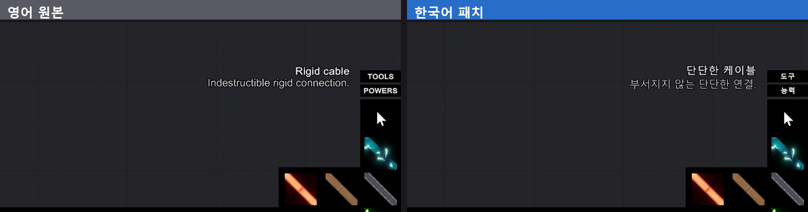

**사람 우클릭 메뉴**
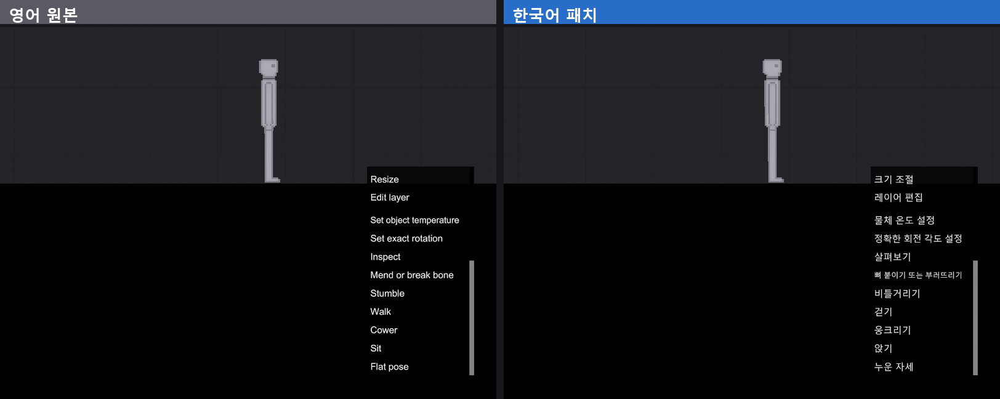

**신체 상세 보기**
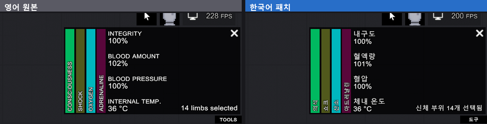

**기계(자동차) 우클릭 메뉴**
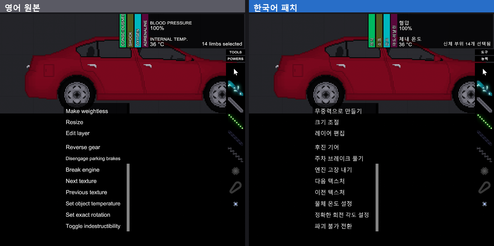

**일시 정지 메뉴**
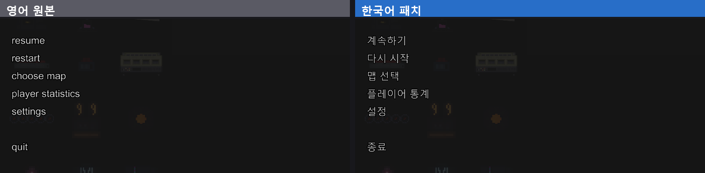

</details>

---

## 설치 방법

### 방법 1: 설치 도우미 (추천)

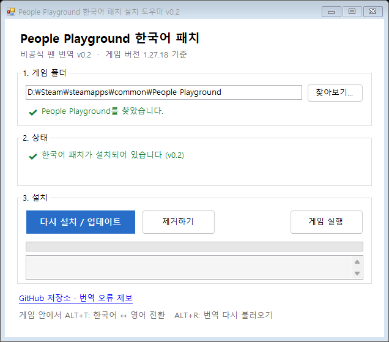

1. 오른쪽 **[Releases](../../releases)** 에서 `PeoplePlayground-Korean-Installer.exe`를 받아 실행합니다.
2. Steam 라이브러리에서 게임 폴더를 자동으로 찾아 줍니다. 못 찾으면 **[찾아보기...]** 로 `People Playground.exe`가 있는 폴더를 고르세요.
3. **[설치하기]** 를 누르면 끝입니다. **[게임 실행]** 으로 바로 확인할 수 있습니다.

- 업데이트할 때도 새 설치 도우미로 **[다시 설치 / 업데이트]** 만 누르면 됩니다.
- 지울 때는 **[제거하기]** 를 누르세요. 설치 도우미가 넣은 파일만 지우고, 다른 BepInEx 플러그인이 있으면 BepInEx 본체는 남겨 둡니다.
- 게임 폴더에 다른 로더(`winhttp.dll`)가 있으면 `PPGKorean_backup` 폴더로 옮겨 두고 설치합니다.
- 서명되지 않은 프로그램이라 Windows가 "PC 보호" 창을 띄울 수 있습니다. **추가 정보 → 실행**을 누르면 됩니다. 소스 코드는 [installer/](installer/)에 있습니다.
- 게임이 `Program Files` 안에 있으면 관리자 권한을 요청합니다.

### 방법 2: 직접 설치

1. 오른쪽 **[Releases](../../releases)** 에서 `PeoplePlayground-Korean-vX.X.zip`을 받습니다.
2. 게임 폴더를 엽니다.
   Steam 라이브러리 → People Playground 우클릭 → **관리** → **로컬 파일 보기**
3. 받은 zip 파일의 **내용물 전체**를 게임 폴더에 풀어 넣습니다.
   `People Playground.exe` 옆에 `winhttp.dll`, `doorstop_config.ini`, `BepInEx` 폴더가 있으면 성공입니다.
   ```
   People Playground\
   ├─ People Playground.exe
   ├─ winhttp.dll            ← 추가됨
   ├─ doorstop_config.ini    ← 추가됨
   └─ BepInEx\               ← 추가됨
   ```
4. 게임을 실행합니다. **첫 실행은 준비 때문에 평소보다 조금 오래 걸립니다.**

### 주의
- 게임 폴더에 이미 `winhttp.dll`이 있다면 다른 모드 로더(BepInEx 등)가 설치된 상태입니다. 덮어쓰면 그 로더가 꺼지니, 무엇인지 확인한 뒤 진행하세요.
  이미 BepInEx 5를 쓰고 있다면 `BepInEx` 폴더 안의 `plugins`, `config`, `Translation`만 합쳐 넣으면 됩니다.
- 이 패치는 게임에 들어 있는 창작마당 모드 로더와 별개입니다. 창작마당 모드 자체의 글자는 번역되지 않습니다.

## 사용 중 단축키

| 키 | 기능 |
|---|---|
| `ALT` + `T` | 한국어 ↔ 영어 원문 전환 |
| `ALT` + `R` | 번역 파일 다시 불러오기 (번역을 고친 뒤) |

## 제거 방법

게임 폴더에서 `winhttp.dll`, `doorstop_config.ini`, `.doorstop_version`, `BepInEx` 폴더를 지우면 원래대로 돌아갑니다.
(Steam의 **게임 파일 무결성 검사**로는 이 파일들이 지워지지 않습니다.)

## 알려진 한계

- 게임이 업데이트되어 새 문장이 추가되면, 그 문장은 번역 파일이 갱신될 때까지 영어로 나옵니다.
- 창작마당 모드가 추가하는 아이템·문장은 번역되지 않습니다.
- 그림(텍스처)에 그려진 글자는 번역되지 않습니다.
- 키보드 키 이름(Tab, Caret 등)과 LED·EMP·Steam 같은 고유명사는 일부러 영어로 두었습니다.

## 번역 오류 제보 / 기여

어색한 번역, 잘린 글자, 영어로 남은 문장을 발견하면 **[Issues](../../issues)** 에 알려 주세요.

- 패치는 번역되지 않은 채 화면에 나온 문장을 자동으로 `BepInEx\PPGKorean_untranslated.txt`에 모읍니다. 이 파일을 첨부해 주시면 큰 도움이 됩니다.
  (끄려면 `BepInEx\config\kr.ppg.koreanfont.cfg`에서 `CollectUntranslated = false`)
- 번역 파일은 `patch/BepInEx/Translation/ko/Text/` 에 있는 텍스트 파일입니다. 한 줄에 `영어=한국어` 형식입니다.
  - 줄바꿈은 `\n`, `=` 기호는 `\=` 로 적습니다. `//`로 시작하는 줄은 주석입니다.
  - `r:"정규식"="번역"` 은 숫자 등이 들어가는 문장용, `sr:"정규식"="번역"` 은 여러 조각을 각각 번역하는 분할 규칙입니다.
  - 용어는 [docs/glossary.md](docs/glossary.md) 를 따라 주세요.
- 고친 뒤 `python tools/validate.py` 로 깨진 줄이 없는지 확인할 수 있습니다.

## 구성과 동작 원리

| 구성 요소 | 역할 |
|---|---|
| [BepInEx 5](https://github.com/BepInEx/BepInEx) | 유니티 게임용 플러그인 로더 |
| [XUnity.AutoTranslator](https://github.com/bbepis/XUnity.AutoTranslator) | 화면에 표시되는 글자를 번역 사전으로 바꿔 줌 (기계번역 기능은 꺼 둠) |
| `PPGKoreanFont.dll` ([plugin/](plugin/)) | 맑은 고딕을 TextMeshPro 한글 대체 폰트로 등록, 한글을 띄어쓰기 단위로 줄바꿈, 미번역 문장 수집 |
| 번역 사전 ([patch/](patch/)) | 영어→한국어 번역 약 1,500개와 조합 문장용 정규식 규칙 |

게임의 TextMeshPro 버전(3.0)은 윈도우 폰트를 직접 불러오지 못합니다. 그래서 플러그인이 TextMeshPro의 `FontEngine.LoadFontFace`를 가로채 `malgun.ttf`를 넘겨주는 방식으로 동적 한글 폰트를 만듭니다.

## 직접 빌드하기

필요: .NET SDK, BepInEx와 XUnity.AutoTranslator가 설치된 게임 폴더

```bash
dotnet build plugin -c Release -p:GameDir="C:\Program Files (x86)\Steam\steamapps\common\People Playground"
```

## 변경 내역

- **v0.2**
  - 아이템·도구 설명 일부가 영어로 나오던 문제를 고쳤습니다. 게임이 툴팁 끝에 마침표를 자동으로 붙여서 생긴 문제입니다.
  - 저장한 장치의 버전 경고문(노란색), 호환되지 않는 장치 안내, 종 음 바꾸기 메뉴, 날개 전환 설명, 맵 입장 버튼을 번역했습니다.
  - 게임 안에서 전수 조사한 결과, 아이템 290여 개의 툴팁과 우클릭 메뉴(버튼 4,400여 개와 그 설명)가 전부 한국어로 나옵니다. 영어로 남은 건 AK-47 같은 고유명사뿐입니다.
- **v0.1**: 첫 배포

## 라이선스와 크레딧

- 이 저장소의 플러그인 코드와 한국어 번역: [MIT License](LICENSE)
- 번역 사전에 들어 있는 영어 원문의 저작권은 게임 개발사 **Studio Minus**에 있습니다.
- 함께 배포하는 외부 프로그램: BepInEx ([LGPL-2.1](licenses/BepInEx-LICENSE.txt)), XUnity.AutoTranslator ([MIT](licenses/XUnity.AutoTranslator-LICENSE.txt)). 자세한 내용은 [THIRD_PARTY_NOTICES.md](THIRD_PARTY_NOTICES.md)를 참고하세요.

이 패치는 비공식 팬 번역이며 Studio Minus와 관련이 없습니다. 패치 사용으로 생기는 문제에 대한 책임은 사용자에게 있습니다.

---

### English

Unofficial Korean translation patch for **People Playground** (game version 1.27.18, Windows).
It is built on BepInEx 5 and XUnity.AutoTranslator and includes about 1,500 hand-translated strings. It also includes a small plugin that registers Malgun Gothic as a TextMeshPro fallback font.
To install, extract the release zip into the game folder, next to `People Playground.exe`. To uninstall, delete `winhttp.dll`, `doorstop_config.ini`, `.doorstop_version` and the `BepInEx` folder.
